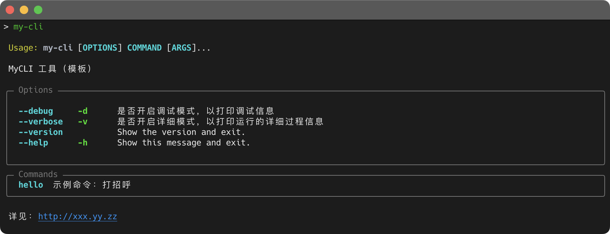
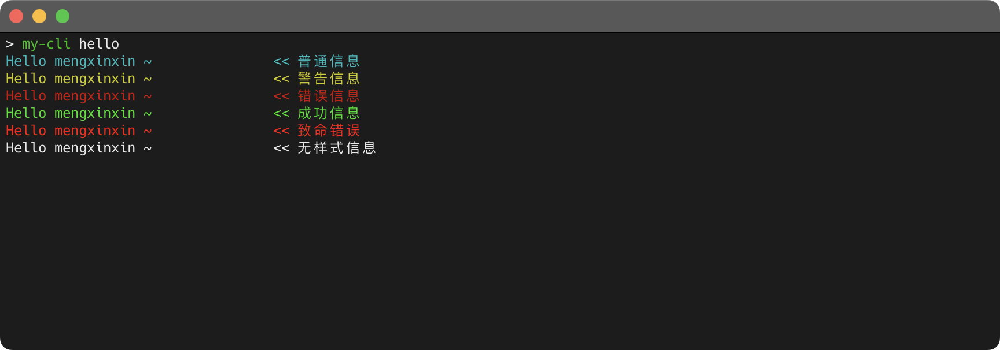
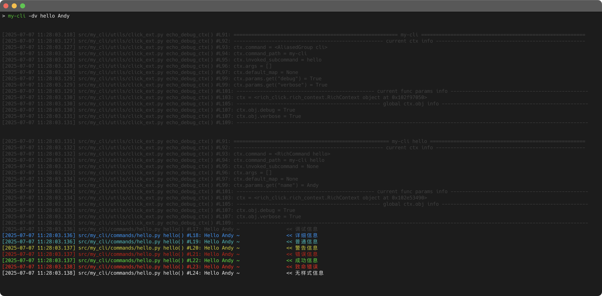

# my-cli

## Introduction

命令行工具 开发模板，基于 Python + Rich Click 开发

已预制常用方法定义&实现，支持复杂参数定义&解析，以便快速开始核心编程




## Features

todo...


## Examples

- 示例命令：`hello`，并支持各类输出样式



- 调试模式：`--debug --version`，以显示丰富的调试信息




## Installation

拉取项目代码后，在项目根目录，执行如下命令：

```shell
# 通过 uv 创建虚拟环境
$ uv venv

# 激活虚拟环境
$ source .venv/bin/activate

# 安装项目，并开启编辑模式（可以直接编辑脚本 并立即生效）
$ pip install --editable .

# 运行脚本
$ my-cli
```

